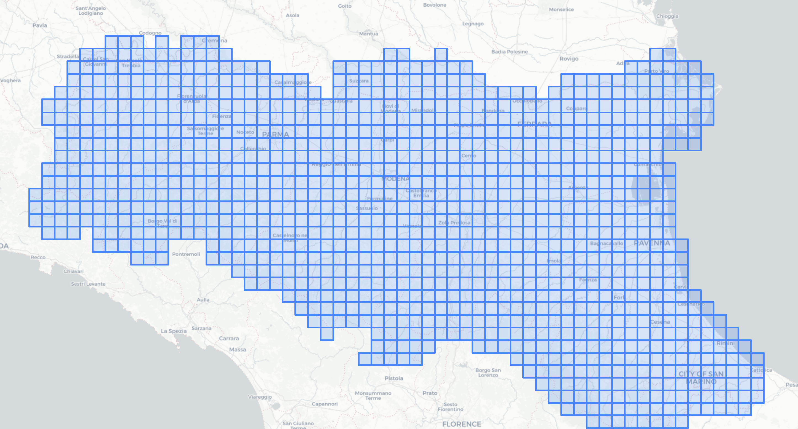

# 🌧️ Precipitation & Temperature — Emilia-Romagna (1961–Present)

> Downloading, processing, and visualising 60+ years of daily climate data
> from the **ERG5 Eraclito61** gridded dataset, published by
> [ARPAE Emilia-Romagna](https://dati.arpae.it/dataset/erg5-eraclito).



---

## Table of Contents

1. [Project Overview](#project-overview)
2. [Scientific Framing](#scientific-framing)
3. [About the ERG5 Eraclito61 Dataset](#about-the-erg5-eraclito61-dataset)
4. [Repository Structure](#repository-structure)
5. [Notebooks — Step by Step](#notebooks--step-by-step)
6. [Data Format](#data-format)
7. [Key Visualisations](#key-visualisations)
8. [Installation & Requirements](#installation--requirements)
9. [Usage](#usage)
10. [Limitations & Future Work](#limitations--future-work)
11. [References & License](#references--license)

---

## Project Overview

This project provides a **complete pipeline** — from raw data download to visual analysis — for exploring daily precipitation and temperature records across Emilia-Romagna, one of Italy's most hydrologically active regions.

Emilia-Romagna sits at the foot of the Apennines and borders the Po river to the north, making it particularly susceptible to extreme precipitation events, including the catastrophic **May 2023 floods** that devastated the Romagna area. Understanding long-term precipitation trends and seasonal patterns in this region is not just academically interesting — it's increasingly urgent.

The data come from the **ERG5 Eraclito61** climate dataset produced by ARPAE's *Osservatorio Clima* (Climate Observatory). It is a daily, spatially interpolated grid of ~5 km resolution covering the full Emilia-Romagna territory (and surrounding areas) continuously from **1961 to the present day**.

---

## Scientific Framing

| Step | Description |
|------|-------------|
| **1. Question** | How do precipitation and temperature vary across the 1,131 ERG5 grid cells of Emilia-Romagna over more than six decades? Are there detectable long-term trends in rainfall? |
| **2. Hypothesis** | Precipitation shows seasonal patterns (wetter spring/autumn, drier summer) with inter-annual variability; a 365-day rolling mean should reveal multi-year wet and dry cycles. |
| **3. Data Collection** | Programmatic bulk download of per-cell annual ZIP files from the ARPAE open data portal, covering 1961–present for all 1,131 grid cells. |
| **4. Analysis** | Raw time-series plotting, percentage change (day-over-day variability), and 365-day rolling mean to expose long-term trend. |
| **5. Conclusions** | Visual identification of anomalous years and long-term shifts in precipitation regime across the region. |

---

## About the ERG5 Eraclito61 Dataset

The *Osservatorio Clima* produces a daily climate dataset of precipitation, minimum temperature, and maximum temperature covering the entire regional territory from 1961 to the present. Data are obtained through spatial interpolation on a regular grid of approximately 5 km using values recorded by the historical meteorological station network.

Only data from historical series that have passed rigorous quality controls are included — in particular, statistical homogeneity, synchronism between measurements, and spatial coherence have all been verified.

The dataset is suitable for long-period regional climate analysis and climate trend analysis because station density is kept constant over time.

The dataset has evolved through **9 versions** since its first release in 2012, progressively improving the interpolation algorithms:

| Version | Period | Resolution | Method |
|---------|--------|------------|--------|
| 1.0 | 1961–2008 | TIN (variable) | Kriging + detrending |
| 3.1 | 1961–2015 | ERG5 (~5 km) | Shepard + topographic distance |
| 4.3 | 1961–present | ERG5 (~5 km) | Shepard + optimal detrending |
| **4.4** | **1961–present** | **ERG5 (~5 km)** | **Shepard + sea proximity correction** |

The grid covers **1,131 cells** spanning not only Emilia-Romagna but also adjacent provinces in Lombardy, Liguria, Tuscany, and Veneto (elevation range: −5.7 m to 1,657.8 m a.s.l.). Provinces covered include: Piacenza, Parma, Reggio Emilia, Modena, Bologna, Ferrara, Ravenna, Forlì-Cesena, and Rimini, plus cross-border cells.

**Data URL pattern:**
```
https://dati-simc.arpae.it/opendata/eraclito/timeseries/{CELL_CODE}/{CELL_CODE}_{YEAR}.zip
```

**License:** [Creative Commons Attribution (CC BY)](http://www.opendefinition.org/licenses/cc-by)

---

## Repository Structure

```
PrecipitationEmiliaRomagna/
│
├── README.md
├── er.png                          ← Map of Emilia-Romagna (used in README)
│
├── # Metadata
├── Erg5_Eraclito_structure.xlsx    ← Registry of all 1,131 grid cells
│                                      (code, name, municipality, province,
│                                       lat/lon WGS84, UTM coordinates, elevation)
├── Eraclito_history.xlsx           ← Version history of the ERG5 dataset
│                                      (algorithms, periods, release years)
│
├── # Sample data file
├── 01421_2025_d.csv                ← Example: cell 01421, year 2025 (daily)
│
├── # Notebooks (run in this order)
├── GetData.ipynb                   ← Step 1: Download data for a single cell
├── GetAllData.ipynb                ← Step 2: Bulk download all 1,131 cells (1961–present)
├── Fix_Data.ipynb                  ← Step 3: Clean and filter raw CSVs
├── CreateCSVFiles.ipynb            ← Step 4: Merge per-year files into per-cell CSVs
├── TemperatureAndPrecipitationData.ipynb  ← Step 5: Explore a single station
├── Analyze.ipynb                   ← Step 6: Regional analysis & visualisation
│
└── data/                           ← Downloaded data directory
    ├── 01152/                      ← Per-cell subfolder (cell code)
    │   ├── 01152_1961_d.csv
    │   ├── 01152_1962_d.csv
    │   └── ...
    ├── 01462_1961_d.csv
    ├── 01462_1962_d.csv
    └── ...
```

---

## Notebooks — Step by Step

### 1. `GetData.ipynb` — Single-Cell Download
Downloads annual ZIP files for **one specific cell** (default: `01152`) from the ARPAE
open data portal, year by year from 1961 to 2023. Each ZIP contains a daily CSV for
that year. Useful for quickly testing the pipeline on a single location before scaling up.

**Key libraries:** `requests`, `zipfile`, `os`

---

### 2. `GetAllData.ipynb` — Bulk Download (All Cells)
The production download script. It reads `Erg5_Eraclito_structure.xlsx` to get the
full list of 1,131 cell codes, then iterates over every cell and every year (1961–2023),
downloading and extracting each annual ZIP into a per-cell subfolder inside `data/`.

This produces the complete dataset — over **70,000 individual CSV files** when run
to completion.

**Key libraries:** `requests`, `zipfile`, `pandas`, `os`

> ⚠️ **Note:** A full download takes significant time and disk space. Run overnight
> or in batches. The ARPAE portal may throttle requests; consider adding a small
> `time.sleep()` between calls.

---

### 3. `Fix_Data.ipynb` — Data Cleaning
Filters out header-row artefacts and corrupted entries from the raw CSVs.
Specifically, it removes rows where `PragaDate` contains the literal string
`"PragaDate"` (i.e. repeated header rows that sneak in during concatenation).
Writes clean files back to disk.

**Key libraries:** `pandas`, `os`

---

### 4. `CreateCSVFiles.ipynb` — Merge per-Year → per-Cell
After downloading, each cell has dozens of small annual CSVs. This notebook walks
all per-cell subfolders and concatenates all years into a **single CSV per cell**,
written to an output folder. The result is one tidy, multi-decade time series per
grid cell, ready for analysis.

Also contains a utility function `drop_rows_every_n()` for removing repeated header
rows that may appear at regular intervals in combined files.

**Key libraries:** `pandas`, `os`, `csv`

---

### 5. `TemperatureAndPrecipitationData.ipynb` — Single-Station Exploration
A quick, self-contained notebook for exploring one station's data without needing the
full bulk dataset. Reads `01421_2025_d.csv` (cell 01421, year 2025) and produces a
time-series line plot of daily precipitation — great for validating data quality and
understanding the file format.

**Key libraries:** `pandas`, `matplotlib`

---

### 6. `Analyze.ipynb` — Regional Visualisation
The main analysis notebook. It loads **all per-cell CSVs** from the `data/` directory
into a single combined DataFrame, then produces three visualisations:

1. **Raw daily precipitation time series** — a long-horizon line chart of all readings
   from a chosen starting point, revealing the spiky, event-driven nature of rainfall.
2. **Day-over-day percentage change** — highlights the volatility and extreme events
   (storms, drought breaks) in the signal.
3. **365-day rolling mean** — smooths out seasonal noise to reveal multi-year trends,
   wet periods, and dry anomalies in the precipitation record.

**Key libraries:** `pandas`, `matplotlib`, `glob`, `os`

---

## Data Format

Each daily CSV file follows the naming convention `{CELL_CODE}_{YEAR}_d.csv` and
contains four columns:

| Column | Description | Unit |
|--------|-------------|------|
| `PragaDate` | Date (ISO format: `YYYY-MM-DD`) | — |
| `DAILY_TMIN` | Daily minimum temperature | °C |
| `DAILY_TMAX` | Daily maximum temperature | °C |
| `DAILY_PREC` | Daily total precipitation | mm |

**Example:**
```
PragaDate,DAILY_TMIN,DAILY_TMAX,DAILY_PREC
2025-01-01,0.8,11.0,0.0
2025-01-02,1.1,10.2,0.0
2025-01-03,3.6,8.2,0.1
```

Cell metadata (from `Erg5_Eraclito_structure.xlsx`) includes: cell code, place name,
municipality (*Comune*), province, region, grid row/column, latitude & longitude
(WGS84), UTM coordinates (32N), and elevation in metres.

---

## Key Visualisations

The `Analyze.ipynb` notebook produces three complementary views of the precipitation signal:

**Raw signal** — captures the episodic nature of rainfall events: long dry stretches
punctuated by intense peaks. Extreme events (flooding episodes, severe storms) stand
out as sharp spikes.

**Percentage change (day-over-day)** — emphasises the volatility of precipitation.
Quiet dry periods appear flat; transition days from dry to wet (or vice versa) generate
large percentage swings.

**365-day rolling mean** — the most climatologically informative view. By averaging
over a full annual cycle, this strips out seasonality and exposes multi-year wet and
dry regimes, making it suitable for detecting climate trends over the 60+ year record.

---

## Installation & Requirements

```bash
# Clone the repository
git clone https://github.com/<your-username>/PrecipitationEmiliaRomagna.git
cd PrecipitationEmiliaRomagna

# Create and activate a virtual environment
python -m venv venv
source venv/bin/activate   # Windows: venv\Scripts\activate

# Install dependencies
pip install pandas matplotlib requests openpyxl jupyter
```

**Python version:** 3.9+ recommended.

---

## Usage

### Quick start — single station

Open `TemperatureAndPrecipitationData.ipynb` — it works out of the box with the
sample file `01421_2025_d.csv` already included in the repository.

### Full pipeline

Run the notebooks in order:

```
GetData.ipynb            →  test download for one cell
GetAllData.ipynb         →  bulk download all cells (1961–present)
Fix_Data.ipynb           →  clean the raw CSVs
CreateCSVFiles.ipynb     →  merge per-year → per-cell
Analyze.ipynb            →  visualise the combined dataset
```

To select a different cell, look up its 5-digit code in `Erg5_Eraclito_structure.xlsx`
and update the `url` variable in `GetData.ipynb` or the loop in `GetAllData.ipynb`.

---

## Limitations & Future Work

- **Spatial accuracy:** The dataset has average spatial accuracy for precipitation and lower accuracy for temperature — results should be interpreted at the regional or macro-area scale, not for individual point locations.
- **Analysis scope:** The current `Analyze.ipynb` pools all grid cells together without spatial disaggregation. A natural next step is to analyse cells individually or by province, enabling spatial comparisons.
- **Potential extensions:**
  - Add a **choropleth map** (Folium or GeoPandas) showing mean annual precipitation per grid cell, using the lat/lon metadata from `Erg5_Eraclito_structure.xlsx`
  - Perform **trend analysis** (Mann-Kendall test) to formally test for statistically significant changes in precipitation over the 60-year record
  - Correlate precipitation anomalies with **flood events** (e.g. the May 2023 Romagna floods) and cross-reference with the road-traffic pollution dataset in [FlussiMTS](../FlussiMTS/)
  - Add **temperature analysis** — the dataset includes `DAILY_TMIN` and `DAILY_TMAX`, which are currently unused in `Analyze.ipynb`
  - Compute **extreme event indicators**: days above a precipitation threshold, dry spell lengths, etc.

---

## References & License

**Data source:**
> ARPAE Emilia-Romagna — *Eraclito61: Dataset climatico dal 1961*
> [https://dati.arpae.it/dataset/erg5-eraclito](https://dati.arpae.it/dataset/erg5-eraclito)
> License: [Creative Commons Attribution (CC BY)](http://www.opendefinition.org/licenses/cc-by)

**Scientific reference:**
> Antolini G., Auteri L., Pavan V., Tomei F., Tomozeiu R., Marletto V. (2015).
> *A daily high-resolution gridded climatic data set for Emilia-Romagna, Italy, during 1961–2010.*
> International Journal of Climatology. DOI: [10.1002/joc.4473](https://doi.org/10.1002/joc.4473)

For questions about the dataset, contact: **osservatorioclima@arpae.it**
